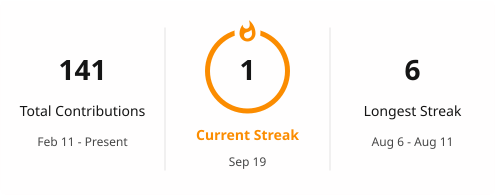

  

<h3 align="center">Hi, I'm Haziqa 👋</h3>

  Teen Data Science student turning what I learn into things that actually run.

 

### About Me

- 🎓 Data Science student exploring Python, AI/ML, and software development
- 🛠️ I build projects to turn what I learn into practical applications
- 📚 Currently learning FastAPI, machine learning, backend development, and AI engineering
- 🌍 Interested in using technology to solve real-world problems — especially in healthcare
- 🧩 I learn by building, debugging, experimenting, and improving

 

### Tech Arsenal

  

`Python` · `Pandas` · `NumPy` · `Scikit-learn` · `TensorFlow` · `FastAPI` · `Flask` · `OpenCV` · `Git` · `GitHub` · `VS Code` · `HTML` · `CSS` · `JavaScript`

 

### GitHub Stats

  
  

  

 

### Featured Projects

| Project | Tech | Description |
|---|---|---|
| **[Healthcare AI](https://github.com/haziqashakirkhan)** | Python · Machine Learning · FastAPI | AI-powered healthcare application focused on turning machine learning into a practical user experience |
| **[Breast Cancer Prediction](https://github.com/haziqashakirkhan)** | Python · Scikit-learn · FastAPI | Machine learning model transformed into an interactive prediction application |
| **[Iris Classification API](https://github.com/haziqashakirkhan)** | Python · FastAPI · Scikit-learn | REST API serving structured, real-time machine learning predictions |
| **[Emotion Recognition](https://github.com/haziqashakirkhan)** | Python · TensorFlow · OpenCV | Deep learning and computer vision project for facial emotion recognition |
| **[Rainfall Prediction](https://github.com/haziqashakirkhan)** | Python · Pandas · Scikit-learn | Machine learning project working with weather and environmental data |

 

### Currently Learning

`Python Development` → `Machine Learning` → `FastAPI & Backend Development` → `AI Engineering` → `ML Model Deployment`

Growing from Data Science into building complete AI applications, one project at a time.

 

### Looking to Collaborate On

- AI / Machine Learning projects
- Data Science projects
- Python applications
- Backend APIs
- Beginner-friendly open-source projects

 

### Ask Me About

`Python` `Data Science` `Machine Learning` `FastAPI` `Scikit-learn` `TensorFlow` `ML Projects`

 

### Fun Fact

> I learn by building. If I discover something interesting, I usually end up turning it into a project just to see how far I can take it.

 

### Developer Quote

> "Code is easy to write and hard to read. Slow down for the reading part."

 

### Contribution Snake

  <picture>
    <source media="(prefers-color-scheme: dark)" srcset="https://raw.githubusercontent.com/haziqashakirkhan/haziqashakirkhan/output/github-contribution-grid-snake-dark.svg">
    <source media="(prefers-color-scheme: light)" srcset="https://raw.githubusercontent.com/haziqashakirkhan/haziqashakirkhan/output/github-contribution-grid-snake.svg">
    
  </picture>

 

### Let's Connect

  <a href="https://haziqashakirkhan-portfolio.vercel.app/">Portfolio</a> &nbsp;·&nbsp;
  <a href="https://github.com/haziqashakirkhan">GitHub</a>
  <!-- add once available:
  &nbsp;·&nbsp; <a href="YOUR_LINKEDIN_URL">LinkedIn</a>
  &nbsp;·&nbsp; <a href="YOUR_BUYMEACOFFEE_URL">Buy Me a Coffee</a>
  -->

 

  Built with quiet confidence, a lot of debugging, and one too many open tabs.

